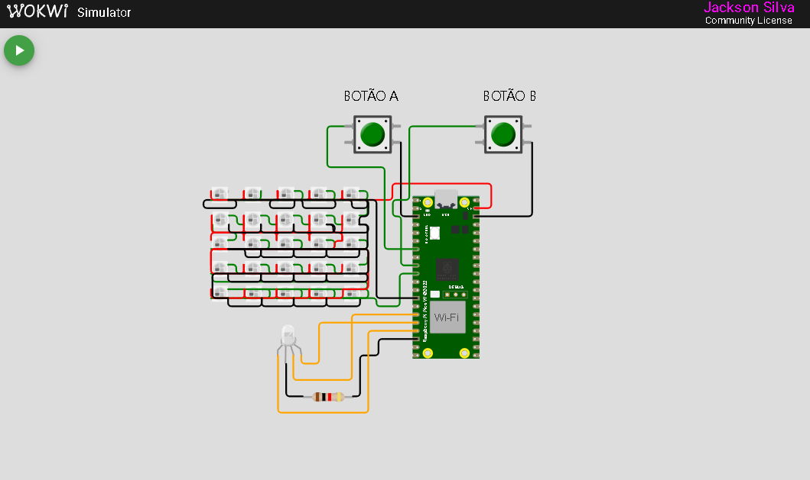

# **Atividade Unidade 4 Capítulo 4 - Interrupções**

## **Descrição**

Tarefa prática do programa de residência EmbarcaTech. O projeto tem como objetivo exibir os números de 0 a 9 na matriz de LEDs 5x5 enquanto um LED vermelho pisca 5 vezes por segundo. É possível incrementar ou decrementar os valores exibidos na matriz utilizando os botões. Além disso, foi implementado deboucing via software para garantir a precisão na leitura dos botoões.

## **Vídeo de apresentação do projeto**

[Vídeo de apresentação do projeto](https://drive.google.com/file/d/16L8Yf-zYkpdHEvUh3KG6svQ3clPE-ReN/view?usp=drive_link)

---

## **Funcionalidades**

- LED piscante: O LED vermelho pisca continuamente 5 vezes por segundo
- Exibição de números na matriz 5x5
- Botão A incrementa o número exibido
- Botão B decrementa o número exibido
- Deboucing dos botões via software

## **Estrutura do projeto**

- **libs/gpio_config.c/h** → Função para inicializar os pinos GPIO
- **libs/matriz_leds.h** → Buffer para armazenas os LEDs ativos
- **libs/pio_config.h** → Configuração do PIO para controle dos LEDs
- **CMakeList.txt** → Configuração do CMake para compilação do projeto
- **diagram.json** → Arquivo de configuração do Wokwi
- **pico_sdk_import.cmake** → Importação do SDK do Raspberry Pi Pico
- **README.md** → Documentação e instruções do projeto
- **Tarefa-Interrupcoes-U4C4** → Código principal do projeto
- **wokwi.toml** → Arquivo de configuração do Wokwi
- **ws2812.pio** → Código PIO para controle dos LEDs WS2812

## **Diagrama de conexões**



1. **LED RGB**
   - Conectado a GPIO 11,12,13
2. **Matriz de LEDs 5x5**
   - Conectado a GPIO 7
3. **Botão A**
   - Conectado a GPIO 5
4. **Botão B**
   - Conectado a GPIO 6

## **Requisitos de Hardware**

_Projeto realizado inicialmente para ser utilizado na placa de desenvolvimento BitDogLab, caso não possua a mesma e queira testar o projeto é necessário:_

- Microcontrolador Raspberry Pi Pico W
- Matriz NeoPixel 5x5
- 2 Botões
- Resistores
- LED RGB

## **Como executar o projeto**

1. **Clone o repositório**
   ```
   git clone https://github.com/jacks0nsilva/TAREFA-INTERRUPCOES-U4C4.git
   ```
2. **Instale a extensão do Raspberry Pi Pico no seu VsCode**
3. **Usando a extensão do Raspberry Pi Pico, siga os passos:**
4. **Clean CMake: Para garantir que o projeto será compilado do zero**

5. **Compile Project: Compilação dos binários**

6. **Run Project [USB]: Compila e copia o firmware para a placa automaticamente**

## **Simulação no Wokwi**

Para iniciar a simulação do projeto no Wokwi basta compilar o código e acessar o arquivo `diagram.json`
Obs: É necessário utilizar a extensão do Wokwi no VsCode.
